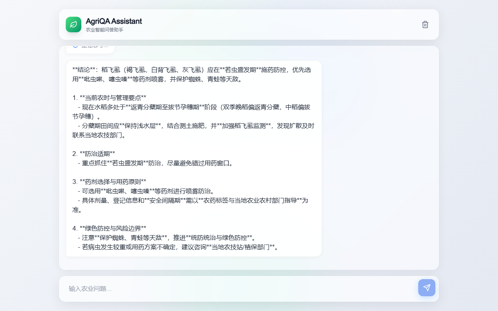
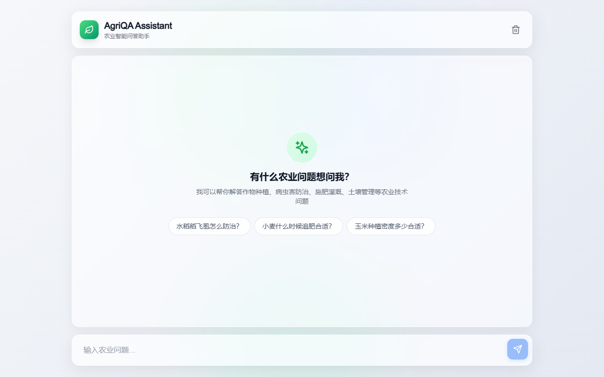
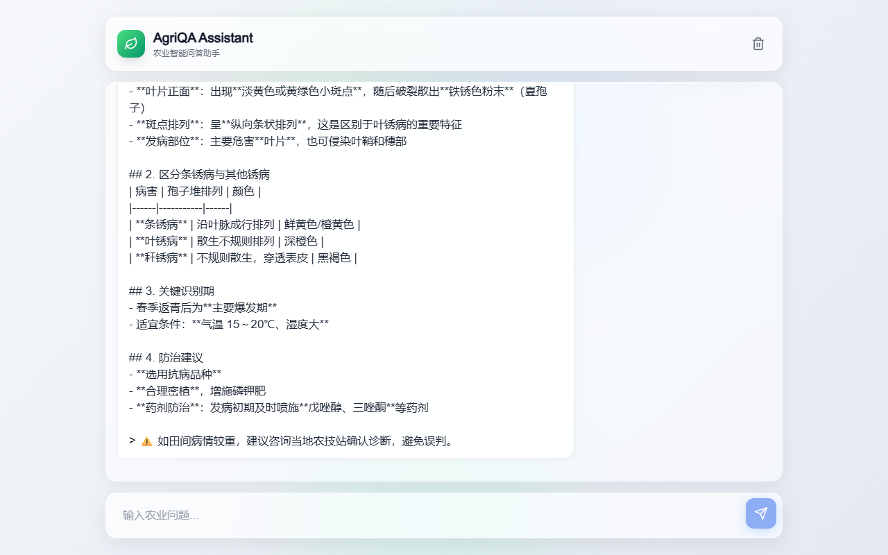
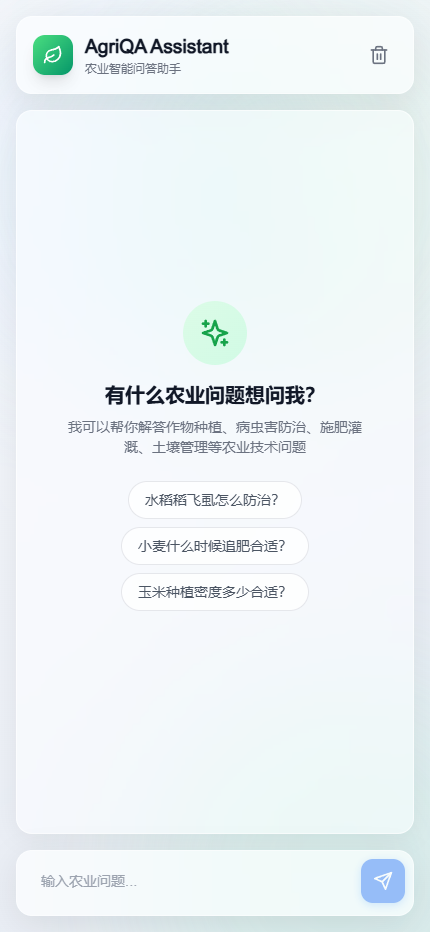
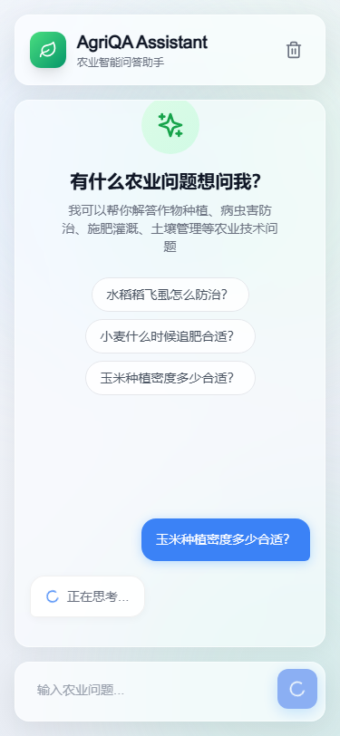

# AgriQA Assistant - 智慧农业智能问答系统

<p align="center">
  
</p>

<p align="center">
  <a href="https://github.com/1byteone/agri-qa-assistant"></a>
  <a href="#"></a>
  <a href="#"></a>
  <a href="#"></a>
  <a href="#"></a>
  <a href="#"></a>
</p>

<p align="center">
  <b>🌾 基于 LangGraph 智能体架构的农业智能问答系统</b><br>
  集成 ChromaDB 私有农业知识库 · 多轮对话记忆 · Apple Liquid Glass 高颜值前端
</p>

---

## ✨ 核心特性

<table>
<tr>
<td width="33%">
<h3>💬 智能对话</h3>
<p>SSE 流式响应、决策卡、知识溯源、专业词条注释，让每次问答都有据可查</p>
</td>
<td width="33%">
<h3>🔍 作物诊断</h3>
<p>结构化症状输入 → 智能诊断 → 证据来源背书，快速识别病虫害</p>
</td>
<td width="33%">
<h3>📅 农事日历</h3>
<p>基于作物、地区、生长阶段的智能农事安排，融合天气风险评估</p>
</td>
</tr>
<tr>
<td>
<h3>📋 政策咨询</h3>
<p>检索惠农政策证据，A 级来源背书，确保政策信息可追溯可验证</p>
</td>
<td>
<h3>📚 RAG 知识库</h3>
<p>ChromaDB 向量检索 + 多策略融合（Hybrid、RRF、Parent-Child）</p>
</td>
<td>
<h3>🎨 Liquid Glass UI</h3>
<p>Apple 风格毛玻璃设计、流畅动画、响应式布局，桌面移动端完美适配</p>
</td>
</tr>
</table>

---

## 📸 产品截图

### 桌面端界面

| 聊天空状态 | 流式回答 | 决策卡 |
|:---:|:---:|:---:|
|  |  |  |

| 知识溯源 | 移动端 | 移动端回答 |
|:---:|:---:|:---:|
|  |  |  |

---

## 🏗️ 技术架构

```
┌──────────────────────────────────────────────────────────────────┐
│                    前端：Next.js 14 + shadcn/ui                   │
│    Apple Liquid Glass 风格 · 毛玻璃效果 · 流畅动画 · 响应式布局    │
└──────────────────────────┬───────────────────────────────────────┘
                           │ HTTP/SSE
┌──────────────────────────▼───────────────────────────────────────┐
│                 后端：FastAPI + LangGraph Agent                    │
│  Domain Guard → Query Router → RAG Pipeline → LLM → Post-process │
│  6 工具：作物知识 · 生长周期 · 农事天气 · 网页获取 · 资源搜索 · 时间  │
└──────────────────────────┬───────────────────────────────────────┘
                           │
┌──────────────────────────▼───────────────────────────────────────┐
│                   知识库：ChromaDB 向量存储                        │
│  多策略检索：Hybrid / RRF Fusion / Parent-Child / 元数据增强      │
│  6 证据包 · 120 项 P0 评估 · 4 级来源注册表                      │
└──────────────────────────┬───────────────────────────────────────┘
                           │
┌──────────────────────────▼───────────────────────────────────────┐
│                    AI：Agnes AI 大模型 + MCP 工具                  │
│   agnes-2.5-flash · text-embedding-3-small · MCP Fetch/Time      │
└──────────────────────────────────────────────────────────────────┘
```

---

## 🎯 场景演示

### 💬 智能对话全流程
输入农业问题 → 流式回答 → 决策卡 → 知识溯源 → 专业词条

### 🔍 作物诊断服务
结构化症状输入 → 智能诊断建议 → 证据来源背书

### 📅 农事日历服务
选择作物/地区 → 生成可执行农事安排 → 天气风险评估

### 📋 政策咨询服务
检索惠农政策证据 → A 级来源背书 → 可追溯验证

---

## 📊 性能指标

| 指标 | 说明 | 状态 |
|------|------|------|
| Recall@K | 检索召回率评估 | ✅ 120 项 P0 用例 |
| Citation Coverage | 引用覆盖率 | ✅ 多策略融合 |
| Faithfulness | 回答忠实度 | ✅ 证据门槛机制 |
| Safety Coverage | 安全边界覆盖 | ✅ Domain Guard |
| 回答模式 | 专业/简要 | ✅ SSE 流式 |
| 知识库规模 | 6 证据包 | ✅ 覆盖主要作物 |

---

## 🚀 快速开始

### 环境要求
- Python 3.10+
- Node.js 18+
- Agnes AI API Key

### 一键启动

```bash
# 1. 克隆项目
git clone https://github.com/1byteone/agri-qa-assistant.git
cd agri-qa-assistant

# 2. 后端
cd backend
pip install -r requirements.txt
python main.py
# 后端运行在 http://localhost:8000

# 3. 前端（新终端）
cd frontend
npm install
npm run dev
# 前端运行在 http://localhost:3000
```

### 配置环境变量
```bash
cp backend/.env.example backend/.env
# 编辑 .env，填入 AGNES_AI_API_KEY
```

---

## 📁 项目结构

```
agri-qa-assistant/
├── backend/                    # FastAPI 后端
│   ├── main.py                # 主应用入口
│   ├── agent.py               # LangGraph Agent
│   ├── knowledge_base.py      # ChromaDB 知识库
│   ├── memory.py              # SQLite 对话记忆
│   ├── tools.py               # 农业工具 + MCP
│   ├── agriir_pipeline.py     # RAG 检索管道
│   ├── retrieval/             # 检索模块
│   ├── farming_calendar.py    # 农事日历
│   ├── case_manager.py        # 案例管理
│   └── data/                  # 数据存储
├── frontend/                   # Next.js 前端
│   ├── app/                   # 页面组件
│   ├── components/            # UI 组件
│   └── lib/                   # 工具函数
├── docs/                      # 文档与营销素材
│   ├── landing-page.html      # 营销落地页
│   └── marketing-kit/         # 营销套件
└── .heroshot/                 # 截图配置
```

---

## 📄 License

MIT © 2026 江西农业大学

---

## 🤝 贡献

欢迎提交 Issue 和 PR！请确保：
1. 代码风格符合项目规范
2. 添加测试用例
3. 更新相关文档

---

<p align="center">
  <b>江西农业大学 · 农业智能技术研究团队</b><br>
  <a href="https://github.com/1byteone/agri-qa-assistant">GitHub</a> ·
  <a href="docs/landing-page.html">营销落地页</a> ·
  <a href="docs/marketing-kit/pitch-deck.md">Pitch Deck</a>
</p>